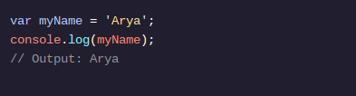

VARIÁVEIS
Crie uma variável: var

Houve muitas mudanças introduzidas na versão ES6 do JavaScript em 2015. Uma das maiores mudanças foram duas novas palavras-chave e let, constpara criar ou declarar variáveis ​​. Antes do ES6, os programadores só podiam usar a varpalavra-chave para declarar variáveis.

Vamos considerar o exemplo acima:

var, abreviação de variável, é uma palavra-chave JavaScript que cria ou declara uma nova variável.
myNameé o nome da variável. Colocar letras maiúsculas dessa forma é uma convenção padrão em JavaScript chamada camel case . Na caixa de camelo, você agrupa as palavras em uma, a primeira palavra é minúscula e cada palavra a seguir terá sua primeira letra maiúscula. (por exemplo, camelCaseEverything).
=é o operador de atribuição . Atribui o valor ( 'Arya') à variável ( myName).
'Arya'é o valor atribuído ( =) à variável myName. Você também pode dizer que a myNamevariável é inicializada com um valor de 'Arya'.
Após a variável ser declarada, o valor da string 'Arya'é impresso no console referenciando o nome da variável: console.log(myName).
Existem algumas regras gerais para nomear variáveis:

Os nomes das variáveis ​​não podem começar com números.
Os nomes das variáveis ​​diferenciam maiúsculas de minúsculas, portanto, myNamee mynameseriam variáveis ​​diferentes. É uma má prática criar duas variáveis ​​com o mesmo nome usando casos diferentes.
Os nomes das variáveis ​​não podem ser iguais às palavras-chave . Para obter uma lista abrangente de palavras-chave, consulte a documentação de palavras-chave do MDN .
Nos próximos exercícios, aprenderemos por que ES6 lete constsão as palavras-chave variáveis ​​preferidas por muitos programadores. Como ainda há muito código escrito antes do ES6, é útil estar familiarizado com a varpalavra-chave pré-ES6.

Se você quiser saber mais sobre varas peculiaridades associadas a ele, verifique a documentação var do MDN .

Instruções
Ponto de verificação 1 ativado
1 .
Declare uma variável nomeada favoriteFoodusando a varpalavra-chave e atribua a ela a string 'pizza'.
2.
Declare uma variável nomeada numOfSlicesusando a varpalavra-chave e atribua a ela o número 8.

Ponto de verificação 3 aprovado
3 .
Na numOfSlicesvariável, use console.log()para imprimir o valor salvo em favoriteFood.

Na linha seguinte, use console.log()para imprimir o valor salvo em numOfSlices.